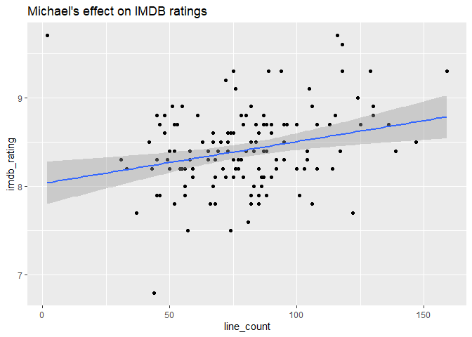
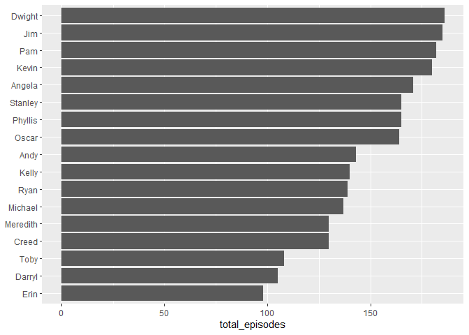

Portland R Users Meetup - Tidy Tuesday Coding Club
================
4/8/2020

  - [Group coding portion - Pierrette, Nell, Ted,
    Aaron](#group-coding-portion---pierrette-nell-ted-aaron)
      - [Install the needed packages](#install-the-needed-packages)
      - [Read vignette & load data](#read-vignette-load-data)
      - [Question: lines per character, does it correlate with
        ratings?](#question-lines-per-character-does-it-correlate-with-ratings)
  - [Next steps - Pierrette](#next-steps---pierrette)
      - [Question - choose characters that appear in many episodes, plot
        line count vs ratings with facet by
        character](#question---choose-characters-that-appear-in-many-episodes-plot-line-count-vs-ratings-with-facet-by-character)
      - [Question - most common words spoken by the above
        characters?](#question---most-common-words-spoken-by-the-above-characters)
      - [Future question: topic
        analysis?](#future-question-topic-analysis)

## Group coding portion - Pierrette, Nell, Ted, Aaron

### Install the needed packages

``` r
#install.packages("schrute")

library(schrute)
library(tidyverse)
library(tidytext)
```

### Read vignette & load data

``` r
vignette("theoffice")

mydata <- theoffice
```

### Question: lines per character, does it correlate with ratings?

Add column for line count per character

``` r
line_count_characters <- mydata %>% 
  group_by(season, episode, character) %>% 
  mutate(line_count = n()) %>%
  arrange(season, episode, desc(line_count)) %>% 
  select(season, episode, character, line_count, imdb_rating, total_votes) %>% 
  distinct()
```

Does number of character’s lines affect ratings?

``` r
line_count_characters %>% 
  filter(character == "Michael") %>% 
  ggplot(aes(x = line_count, y = imdb_rating)) + 
  geom_point() +
  geom_smooth(method = "lm") +
  ggtitle("Michael's effect on IMDB ratings")
```

<!-- -->

There is maybe a weak correlation, but the range of ratings is so narrow
that it’s hard to tell if it’s meaningful.

**This is where we stopped at the Meetup.**

## Next steps - Pierrette

### Question - choose characters that appear in many episodes, plot line count vs ratings with facet by character

Add column for total episodes per character

``` r
line_count_characters <- line_count_characters %>%
  group_by(character) %>% 
  mutate(total_episodes = n()) %>% 
  ungroup()
```

Count number of episodes for sanity check (186)

``` r
line_count_characters %>% 
  select(season, episode) %>% 
  distinct() %>% 
  nrow()
```

    ## [1] 186

Look at number of episodes for top characters

``` r
line_count_characters %>%
  select(character, total_episodes) %>% 
  distinct() %>% 
  arrange(desc(total_episodes)) %>%
  filter(total_episodes > 90) %>% # arbitrary number I chose 
  ggplot(aes(x = reorder(as.factor(character), total_episodes), y = total_episodes, group = character)) +
  geom_col() +
  coord_flip() +
  xlab(NULL)
```

<!-- -->

Plot character lines vs ratings, facet by character

``` r
line_count_characters %>% 
  filter(total_episodes > 90) %>% 
  ggplot(aes(x = line_count, y = imdb_rating)) + 
  geom_point() +
  geom_smooth(method = "lm") +
  facet_wrap(~character, scales = "free_x") +
  ggtitle("Effects of main characters' line counts on IMDB ratings")
```


Conclusion: People don’t like Andy.

How can we calculate actual correlations?

### Question - most common words spoken by the above characters?

``` r
# get main characters

main_char <- line_count_characters %>%
  select(character, total_episodes) %>% 
  distinct() %>% 
  arrange(desc(total_episodes)) %>%
  filter(total_episodes > 90) %>% 
  pull(character) 

# add Todd Packer, just because

main_char <- c(main_char, "Todd Packer")

# use {tidytext} to unnest lines into words

token_data <- mydata %>%
  select(character, text) %>% 
  filter(character %in% main_char) %>% 
  unnest_tokens(word, text)

# remove stop words

token_data <- token_data %>% 
  anti_join(stop_words, by = "word")

# get word counts

wordcount_data <- token_data %>%
  group_by(character, word) %>% 
  mutate(word_count = n()) %>%
  ungroup() %>% 
  distinct() 
```

Plot top 15 most common words per character

``` r
wordcount_data %>% 
  group_by(character) %>% 
  top_n(15) %>% 
  arrange(character, desc(word_count)) %>% 
  ungroup() %>% 
  ggplot(aes(x = reorder_within(word, word_count, character), y = word_count)) +
  geom_col() +
  scale_x_reordered() +
  facet_wrap(~character, nrow = 3, scales = "free") +
  coord_flip() +
  ggtitle("Top 15 words spoken by each main character") +
  xlab(NULL)
```

    ## Selecting by word_count


``` r
#ggsave("wordcount_by_char.png", width = 10, height = 7)
```

I thought this was more illuminating than the ratings analysis,
especially if you’re familiar with the show.

Issue: Todd Packer doesn’t have a lot of lines, so his top\_n(15) words
is actually a lot more than 15 due to ties. How to handle this?

### Future question: topic analysis?
